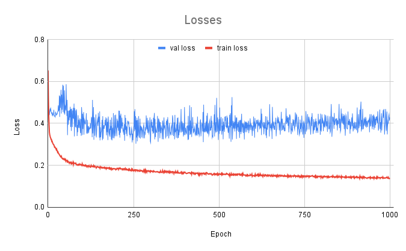

# u-net implementation


## Information

This project is a precise implementation of the u-net architecture from the original paper.
Therefore, the majority of the hyperparameters' choices were based on the choices reported in the paper.

To start using the code, you will need to set up a few directories.
To do it you could run the following in the terminal from the directory with your train.py file.
```
mkdir data
cd data
mkdir test train
cd test
mkdir images masks
cd ../train
mkdir images masks
```
After that, you will need to unpack your data. If you want to use the same dataset, simply run the __unpack_tiffs.py.__

You will also need to create two directories for saving the model checkpoints and end weights.
From the initial directory:
```
mkdir weigths checkpoints
```
## Model

<p align="center">
  
</p>

## Training

* __1000 epochs__ (~~original: 10 hours on Nvidia Titan GPU 6Gb~~)
* Loss function: Cross Entropy Loss
* Optimizer: Stochastic Gradient Descent
* Momentum: 0.99
* Batch size: 1

## Results

Link to Weights and Biases [project](https://wandb.ai/sergey-khvan/u-net?nw=nwusersergeykhvan)

|               | Warping Error | Rand Error | Pixel Error |
| :---          |    :----:     |      :---: |---:         |
| Implementation| 0.000833      | 0.12075    | 0.075       |
| Paper         | 0.000353      | 0.0382     |  0.0611     |

### 
<p align="center">
  
</p>